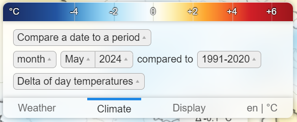

import { Aside } from "@astrojs/starlight/components";

The main "Climate" tab of Climoscope is simple, yet powerful:

- First line is the [mode](#modes)
- Last line is the [element](#elements)
- Other lines are for [dates](#dates) and [periods](#periods)

<Aside type="note" title="Transitions">
  Not all modes, elements and date formats are compatible between them. When you
  change the value of one of these items, Climoscope might also change the value
  of other items to keep things coherent.
</Aside>

### Dates

A "date" in Climoscope is really a time period. This time period can be a:

- **day** : for example the 21st of December 1974. Over a day, we can compute day and night temperatures, total precipitations,
  but no averages or rainy day count...
- **month** : for example December 1974. Over a month, we average data from days, and we can compute number of rainy days.
- **year** : for example 1974. Over a year, we average data from days, and we can compute number of rainy days.

When viewing a [period](#periods), where the data is averaged over multiple years, the **year** component of the date is not
available.

### Periods

Climate is simply an average of atmospheric conditions over a very long period of time; usually, scientists use periods of 30 years
to compute this average. Climoscope uses the following periods:

- 1941-1970
- 1951-1980
- 1961-1990
- 1971-2000
- 1981-2010
- 1991-2020

### Modes

There are four available modes:

- **view a date** : Displays data for a given [date](#dates) (a day, month or year)
- **view a period** : Displays data for a given [period](#periods)
- **compare a date to a period** : Compares a given [date](#dates) (day, month, or year) to a given [period](#periods). This
  is typically used to compute variations and anomalies, eg is this month hot or cold compared to normals?
- **compare a period to a period** : Compares two [periods](#periods). Comparison can be made on whole years, or specific months, or even days.
  This is used to compute the climate change between two periods.

### Elements

Depending on the [mode](#modes) and/or the [date](#dates), different elements are available. Some examples:

- **Day temperature** : maximum temperature during the day
- **Average of day temperature** : average of the day temperatures over a date
- **Delta of day temperature** : delta of the day temperatures, compared to normals during a period
- **Precipitations** : total quantity of precipitations over a date
- **Number of rainy days** : number of days where it rained more than 1mm over a date
- **etc...**
