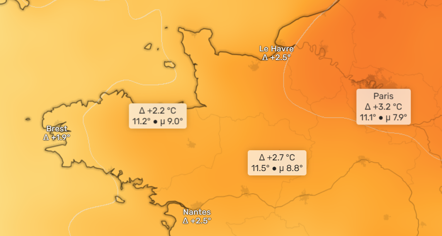

# 🏷️ Tags

A Tag is a label on the map that displays information at a location. There are three types of tags:

- The **mouse tag** displays full information at the mouse cursor (on devices with a mouse)
- **City tags** display simple information for major cities. Cities appear and disappear according to the map zoom level. You
  can choose the density of displayed cities in the preferences.
- **User tags** display full information at chosen location, they are displayed on a darker background

> **Note**: The value of a tag may differ from values recorded by local stations. This is because Climoscope uses a grid with a precision
> of around 32km. Very local conditions such as [urban heat island (UHI)](https://en.wikipedia.org/wiki/Urban_heat_island), valleys, or small
> islands may not be properly recorded.

To set a user tag, simply **click on the map**. To remove it, simply **click on it**. By clicking on a city tag, it can be
converted back and forth to a user tag (more detailed information, visible at any zoom level).

On the following picture, Brest and Nantes are city tags, Paris is a user tag converted from a city tag, the tag for Asterix' village
is a user tag, and the tag near the mouse pointer (not visible, duh!) is the mouse tag.



### Tag text

Tags use symbols for brevity:

- `v` : the current value
- `μ` : the value of the [mean](https://en.wikipedia.org/wiki/Mean)
- `σ` : the value of the [standard deviation](https://en.wikipedia.org/wiki/Standard_deviation)

Examples:

<table>
<tr>
<td>
Comparison of temperatures of a year to a period
```
+ 3.3 °C
v:12.4° μ:9.1°
```
The temperature this year was +3.3°C above period average, the temperature is 12.4°C and the average is 9.1°C.
</td>
<td>
Comparison (σ) of rainy days of a month to a period
```
- 2.7 σ
v:10.0 μ:3.5 σ:2.4
```
The number of rainy days this month was 2.7σ above the average (which is a [rare event](https://en.wikipedia.org/wiki/Standard_deviation#Chebyshev's_inequality)), 
It rained 10 days, while the average for this month is 3.5, the standard deviation is 2.4 days. In this case, 2.7 = (μ-v)/σ
</td>

</tr></table>
