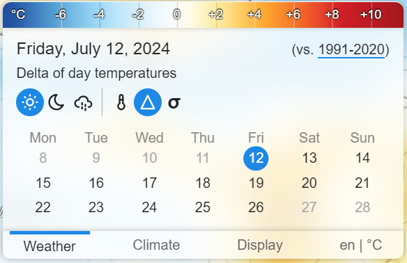

import { Aside } from "@astrojs/starlight/components";

The "Weather" tab is a fraud! Everything this tab can do, can be also done in the "Climate" tab. This tab is just easier on the eyes
and makes it easier to navigate to future dates. Everything should be self-explanatory...
